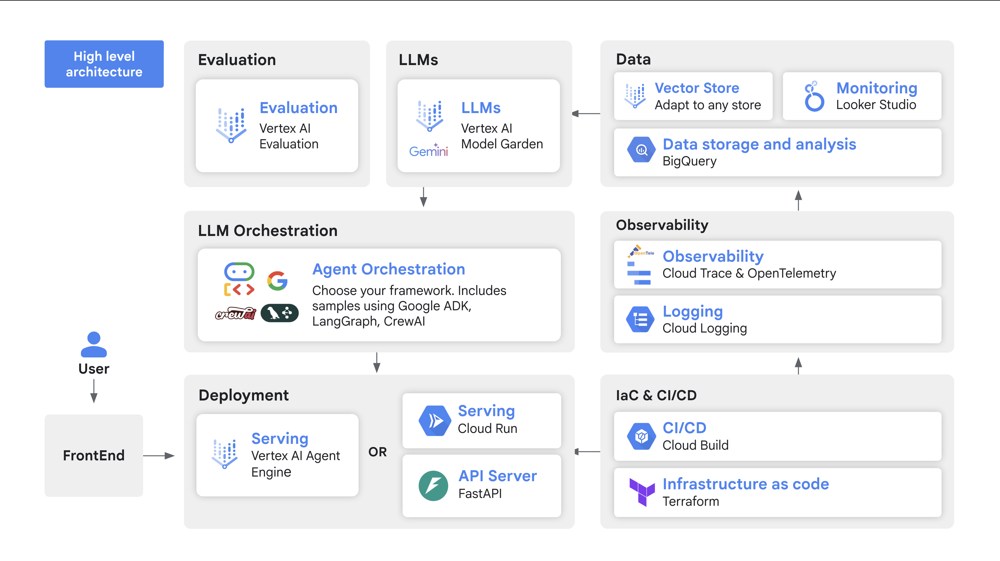

# 🚀 Agent Starter Pack

 [](https://youtu.be/jHt-ZVD660g) [](https://googlecloudplatform.github.io/agent-starter-pack/) <a href="https://studio.firebase.google.com/new?template=https%3A%2F%2Fgithub.com%2FGoogleCloudPlatform%2Fagent-starter-pack%2Ftree%2Fmain%2Fsrc%2Fresources%2Fidx">
  <picture>
    <source
      media="(prefers-color-scheme: dark)"
      srcset="https://cdn.firebasestudio.dev/btn/try_light_20.svg">
    <source
      media="(prefers-color-scheme: light)"
      srcset="https://cdn.firebasestudio.dev/btn/try_dark_20.svg">
    
  </picture>
</a> [](https://shell.cloud.google.com/cloudshell/editor?cloudshell_git_repo=https%3A%2F%2Fgithub.com%2Feliasecchig%2Fasp-open-in-cloud-shell&cloudshell_print=open-in-cs) 


The `agent-starter-pack` is a collection of production-ready Generative AI Agent templates built for Google Cloud. <br>
It accelerates development by providing a holistic, production-ready solution, addressing common challenges (Deployment & Operations, Evaluation, Customization, Observability) in building and deploying GenAI agents.

| ⚡️ Launch | 🧪 Experiment  | ✅ Deploy | 🛠️ Customize |
|---|---|---|---|
| [Pre-built agent templates](./agents/) (ReAct, RAG, multi-agent, Live API). | [Vertex AI evaluation](https://cloud.google.com/vertex-ai/generative-ai/docs/models/evaluation-overview) and an interactive playground. | Production-ready infra with [monitoring, observability](https://googlecloudplatform.github.io/agent-starter-pack/guide/observability), and [CI/CD](https://googlecloudplatform.github.io/agent-starter-pack/guide/deployment) on [Cloud Run](https://cloud.google.com/run) or [Agent Engine](https://cloud.google.com/vertex-ai/generative-ai/docs/agent-engine/overview). | Extend and customize templates according to your needs. |

---
 
## ⚡ Get Started in 1 Minute

Ready to build your AI agent? Simply run this command:

```bash
# Create and activate a Python virtual environment
python -m venv .venv && source .venv/bin/activate

# Install the agent starter pack
pip install agent-starter-pack

# Create a new agent project
agent-starter-pack create my-awesome-agent
```

**That's it!** You now have a fully functional agent project—complete with backend, frontend, and deployment infrastructure—ready for you to explore and customize.
See [Installation Guide](https://googlecloudplatform.github.io/agent-starter-pack/guide/installation) for more options, or try with zero setup in [Firebase Studio](https://studio.firebase.google.com/new?template=https%3A%2F%2Fgithub.com%2FGoogleCloudPlatform%2Fagent-starter-pack%2Ftree%2Fmain%2Fsrc%2Fresources%2Fidx) or [Cloud Shell](https://shell.cloud.google.com/cloudshell/editor?cloudshell_git_repo=https%3A%2F%2Fgithub.com%2Feliasecchig%2Fasp-open-in-cloud-shell&cloudshell_print=open-in-cs).

---

 🆕 The starter pack offers full support for Agent Engine, a new fully managed solution to deploy agents. Simply run this command to get started:

```bash
agent-starter-pack create my-agent -d agent_engine -a adk_base
```

*See the [full list of options](https://googlecloudplatform.github.io/agent-starter-pack/cli/create) for details.*

## 🤖 Agents

| Agent Name                  | Description                                                                                                                       |
|-----------------------------|-----------------------------------------------------------------------------------------------------------------------------------|
| `adk_base`      | A base ReAct agent implemented using Google's [Agent Development Kit](https://github.com/google/adk-python) |
| `adk_gemini_fullstack` | A production-ready fullstack research agent with Gemini that demonstrates complex agentic workflows, modular agent design, and Human-in-the-Loop steps. [ADK Samples](https://github.com/google/adk-samples/tree/main/python/agents/gemini-fullstack) |
| `agentic_rag` | A RAG agent for document retrieval and Q&A. Supporting [Vertex AI Search](https://cloud.google.com/generative-ai-app-builder/docs/enterprise-search-introduction) and [Vector Search](https://cloud.google.com/vertex-ai/docs/vector-search/overview).       |
| `langgraph_base_react`      | An agent implementing a base ReAct agent using LangGraph |
| `crewai_coding_crew`       | A multi-agent system implemented with CrewAI created to support coding activities       |
| `live_api`       | A real-time multimodal RAG agent powered by Gemini, supporting audio/video/text chat with vector DB-backed responses                       |

**More agents are on the way!** We are continuously expanding our [agent library](https://googlecloudplatform.github.io/agent-starter-pack/agents/overview). Have a specific agent type in mind? [Raise an issue as a feature request!](https://github.com/GoogleCloudPlatform/agent-starter-pack/issues/new?labels=enhancement)

**🔍 ADK Samples**

Looking to explore more ADK examples? Check out the [ADK Samples Repository](https://github.com/google/adk-samples) for additional examples and use cases demonstrating ADK's capabilities.

#### Extra Features

The `agent-starter-pack` offers two key features to accelerate and simplify the development of your agent:
- **🔄 [CI/CD Automation (Experimental)](https://googlecloudplatform.github.io/agent-starter-pack/cli/setup_cicd)** - One command to set up a complete GitHub + Cloud Build pipeline for all environments
- **📥 [Data Pipeline for RAG with Terraform/CI-CD](https://googlecloudplatform.github.io/agent-starter-pack/guide/data-ingestion)** - Seamlessly integrate a data pipeline to process embeddings for RAG into your agent system. Supporting [Vertex AI Search](https://cloud.google.com/generative-ai-app-builder/docs/enterprise-search-introduction) and [Vector Search](https://cloud.google.com/vertex-ai/docs/vector-search/overview).


## High-Level Architecture

This starter pack covers all aspects of Agent development, from prototyping and evaluation to deployment and monitoring.



---

## 🔧 Requirements

- Python 3.10+
- [Google Cloud SDK](https://cloud.google.com/sdk/docs/install)
- [Terraform](https://developer.hashicorp.com/terraform/downloads) (for deployment)


## 📚 Documentation

Visit our [documentation site](https://googlecloudplatform.github.io/agent-starter-pack/) for comprehensive guides and references!

- [Getting Started Guide](https://googlecloudplatform.github.io/agent-starter-pack/guide/getting-started) - First steps with agent-starter-pack
- [Installation Guide](https://googlecloudplatform.github.io/agent-starter-pack/guide/installation) - Setting up your environment
- [Deployment Guide](https://googlecloudplatform.github.io/agent-starter-pack/guide/deployment) - Taking your agent to production
- [Agent Templates Overview](https://googlecloudplatform.github.io/agent-starter-pack/agents/overview) - Explore available agent patterns
- [CLI Reference](https://googlecloudplatform.github.io/agent-starter-pack/cli/) - Command-line tool documentation


### Video Walkthrough:

- **[Exploring the Agent Starter Pack](https://www.youtube.com/watch?v=9zqwym-N3lg)**: A comprehensive tutorial demonstrating how to rapidly deploy AI Agents using the Agent Starter Pack, covering architecture, templates, and step-by-step deployment.

- **[6-minute introduction](https://www.youtube.com/live/eZ-8UQ_t4YM?feature=shared&t=2791)** (April 2024): Explaining the Agent Starter Pack and demonstrating its key features. Part of the Kaggle GenAI intensive course.

- **[120-minute livestream demo](https://www.youtube.com/watch?v=yIRIT_EtALs&t=235s)** (March 6, 2025): Watch us build 3 Agents in under 30 minutes using the `agent-starter-pack`!


Looking for more examples and resources for Generative AI on Google Cloud? Check out the [GoogleCloudPlatform/generative-ai](https://github.com/GoogleCloudPlatform/generative-ai) repository for notebooks, code samples, and more!

## Contributing

Contributions are welcome! See the [Contributing Guide](CONTRIBUTING.md).

## Feedback

We value your input! Your feedback helps us improve this starter pack and make it more useful for the community.

### Getting Help

If you encounter any issues or have specific suggestions, please first consider [raising an issue](https://github.com/GoogleCloudPlatform/generative-ai/issues) on our GitHub repository.

### Share Your Experience

For other types of feedback, or if you'd like to share a positive experience or success story using this starter pack, we'd love to hear from you! You can reach out to us at <a href="mailto:agent-starter-pack@google.com">agent-starter-pack@google.com</a>.

Thank you for your contributions!

## Disclaimer

This repository is for demonstrative purposes only and is not an officially supported Google product.

## Terms of Service

The agent-starter-pack templating CLI and the templates in this starter pack leverage Google Cloud APIs. When you use this starter pack, you'll be deploying resources in your own Google Cloud project and will be responsible for those resources. Please review the [Google Cloud Service Terms](https://cloud.google.com/terms/service-terms) for details on the terms of service associated with these APIs.
