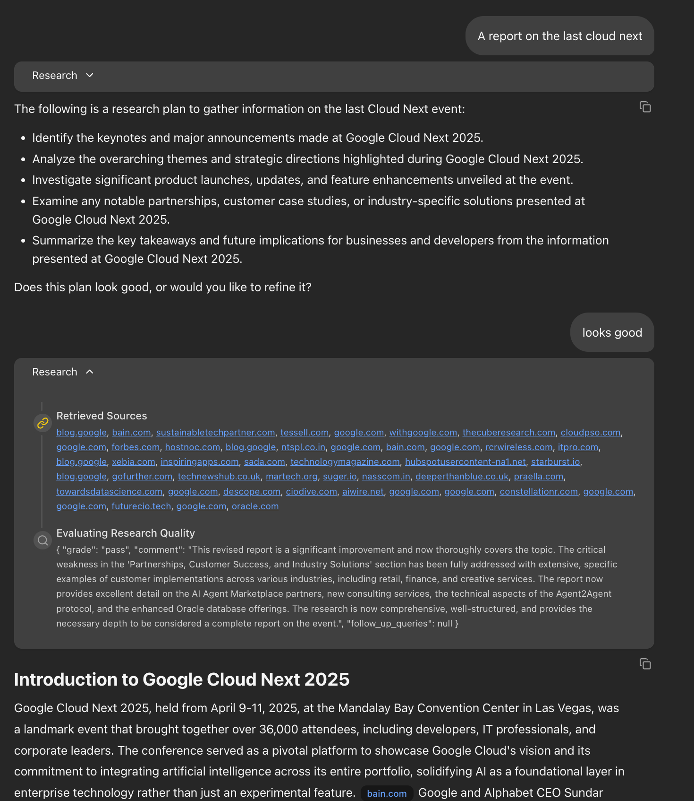
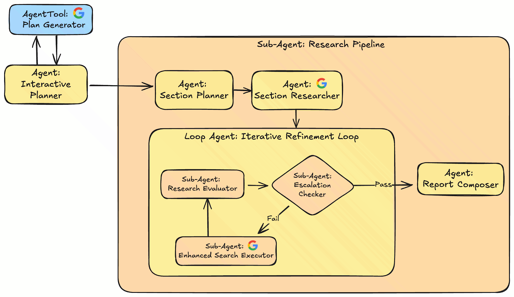

# Gemini Fullstack Agent Development Kit (ADK) Quickstart

The **Gemini Fullstack Agent Development Kit (ADK) Quickstart** is a production-ready blueprint for building a sophisticated, fullstack research agent with Gemini. It's built to demonstrate how the ADK helps structure complex agentic workflows, build modular agents, and incorporate critical Human-in-the-Loop (HITL) steps.

<table>
  <thead>
    <tr>
      <th colspan="2">Key Features</th>
    </tr>
  </thead>
  <tbody>
    <tr>
      <td>🏗️</td>
      <td><strong>Fullstack & Production-Ready:</strong> A complete React frontend and ADK-powered FastAPI backend, with deployment options for <a href="https://cloud.google.com/run">Google Cloud Run</a> and <a href="https://cloud.google.com/vertex-ai/generative-ai/docs/agent-engine/overview">Vertex AI Agent Engine</a>.</td>
    </tr>
    <tr>
      <td>🧠</td>
      <td><strong>Advanced Agentic Workflow:</strong> The agent uses Gemini to <strong>strategize</strong> a multi-step plan, <strong>reflect</strong> on findings to identify gaps, and <strong>synthesize</strong> a final, comprehensive report.</td>
    </tr>
    <tr>
      <td>🔄</td>
      <td><strong>Iterative & Human-in-the-Loop Research:</strong> Involves the user for plan approval, then autonomously loops through searching (via Gemini function calling) and refining its results until it has gathered sufficient information.</td>
    </tr>
  </tbody>
</table>



This project adapts concepts from the [Gemini FullStack LangGraph Quickstart](https://github.com/google-gemini/gemini-fullstack-langgraph-quickstart) for the frontend app. 

## 🚀 Getting Started: From Zero to Running Agent in 1 Minute

**Prerequisites:**

* **[Python 3.10+](https://www.python.org/downloads/)**
* **[Node.js and npm](https://nodejs.org/)**
* **[Google Cloud SDK](https://cloud.google.com/sdk/docs/install)**

### Step 1: Create Your Agent Project


This command uses the [Agent Starter Pack](goo.gle/agent-starter-pack) to create a new directory (`my-fullstack-agent`) with all the necessary code.
```bash
# Create and activate a virtual environment
python -m venv .venv && source .venv/bin/activate # On Windows: .venv\Scripts\activate

# Install the starter pack and create your project
pip install --upgrade agent-starter-pack
agent-starter-pack create my-fullstack-agent -a adk_gemini_fullstack
```

<details>
<summary>⚡️ Alternative: Using uv</summary>

If you have [`uv`](https://github.com/astral-sh/uv) installed, you can create and set up your project with a single command:

```bash
uvx agent-starter-pack create my-fullstack-agent -a adk_gemini_fullstack
```
This command handles creating the project without needing to pre-install the package into a virtual environment.

</details>

You'll be prompted to select a deployment option (Agent Engine or Cloud Run) and verify your Google Cloud credentials.

### Step 2: Install Dependencies & Run the Agent

Now, navigate into your new project, install the dependencies, and start the servers with a single command.

```bash
cd my-fullstack-agent && make install && make dev
```

Your agent should now be running!
*   Backend API: `http://localhost:8000`
*   Frontend UI: `http://localhost:5173`

## ☁️ Deployment

You can quickly deploy your agent to a **development environment** on Google Cloud. You can deploy your latest code at any time with:

```bash
# Replace YOUR_DEV_PROJECT_ID with your actual Google Cloud Project ID
gcloud config set project YOUR_DEV_PROJECT_ID
make backend
```

For robust, **production-ready deployments** with automated CI/CD, please follow the detailed instructions in the **[Agent Starter Pack Development Guide](https://googlecloudplatform.github.io/agent-starter-pack/guide/development-guide.html#b-production-ready-deployment-with-ci-cd)**.

## How the Agent Thinks: A Two-Phase Workflow

The backend agent, defined in `app/agent.py`, follows a sophisticated workflow to move from a simple topic to a fully-researched report.

The following diagram illustrates the agent's architecture and workflow:



This process is broken into two main phases:

### Phase 1: Plan & Refine (Human-in-the-Loop)

This is the collaborative brainstorming phase.

1.  **You provide a research topic.**
2.  The agent generates a high-level research plan with several key goals (e.g., "Analyze the market impact," "Identify key competitors").
3.  The plan is presented to **you**. You can approve it, or chat with the agent to add, remove, or change goals until you're satisfied. Nothing happens without your explicit approval.

### Phase 2: Execute Autonomous Research

Once you approve the plan, the agent's `research_pipeline` takes over and works autonomously.

1.  **Outlining:** It first converts the approved plan into a structured report outline (like a table of contents).
2.  **Iterative Research & Critique Loop:** For each section of the outline, it repeats a cycle:
    *   **Search:** It performs web searches to gather information.
    *   **Critique:** A "critic" model evaluates the findings for gaps or weaknesses.
    *   **Refine:** If the critique finds weaknesses, the agent generates more specific follow-up questions and searches again. This loop continues until the research meets a high-quality bar.
3.  **Compose Final Report:** After the research loop is complete, a final agent takes all the verified findings and writes a polished report, automatically adding inline citations that link back to the original sources.

You can edit key parameters (Gemini models, research loop iterations) in the `ResearchConfiguration` dataclass within `app/config.py`.

## 🔄 Frontend-Backend Integration

The frontend UI integrates with the backend through specific agent names that:

1. **Process agent outputs** - Different outputs are handled in specific ways (research findings vs. final report)
2. **Update the activity timeline** - Each agent's activity appears with appropriate titles and icons
3. **Track research metrics** - Website counts and progress indicators are based on agent activities

Important agent names for frontend functionality:

- `section_researcher` & `enhanced_search_executor`: Track websites consulted
- `report_composer_with_citations`: Processes final report with citations
- `interactive_planner_agent`: Updates AI messages during planning
- Other agents (`plan_generator`, `section_planner`, etc.): Used for timeline labels

If you modify agent names in `app/agent.py`, update the frontend code accordingly to maintain functionality.

## 🛠️ Technologies Used

### Backend
*   [**Agent Development Kit (ADK)**](https://github.com/google/adk-python): The core framework for building the stateful, multi-turn agent.
*   [**FastAPI**](https://fastapi.tiangolo.com/): High-performance web framework for the backend API.
*   [**Google Gemini**](https://cloud.google.com/vertex-ai/generative-ai/docs): Used for planning, reasoning, search query generation, and final synthesis.

### Frontend
*   [**React**](https://reactjs.org/) (with [Vite](https://vitejs.dev/)): For building the interactive user interface.
*   [**Tailwind CSS**](https://tailwindcss.com/): For utility-first styling.
*   [**Shadcn UI**](https://ui.shadcn.com/): A set of beautifully designed, accessible components.
