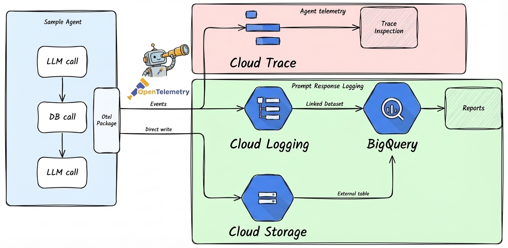

# Monitoring and Observability



## Overview

The Agent Starter Pack provides two levels of observability:

1. **Agent Telemetry Events** (Always Enabled): OpenTelemetry traces and spans for agent operations, exported to **Cloud Trace**. This tracks agent execution, latency, and system metrics.

2. **Prompt-Response Logging** (Configurable): GenAI instrumentation that captures LLM interactions (prompts, responses, tokens) and exports them to **Google Cloud Storage** (JSONL), **BigQuery** (external tables), and **Cloud Logging** (dedicated bucket). This is **disabled by default in local development** and **enabled by default in deployed environments**.

**Note for LangGraph users**: The LangGraph template only supports agent telemetry events (Cloud Trace). Prompt-response logging is not available due to SDK limitations with streaming responses.

## How It Works

### Agent Telemetry Events (Always Enabled)

All agent templates automatically export OpenTelemetry traces and spans to **Cloud Trace** for distributed tracing, request flows, and latency analysis.

This level of telemetry is always active and requires no configuration.

### Prompt-Response Logging (Configurable)

For **ADK-based agents only**, the telemetry setup (`app/app_utils/telemetry.py`) can be configured to capture:

- **GenAI Event Capture**: Records model interactions, token usage, and performance metrics
- **GCS Upload**: Automatically uploads telemetry data to a dedicated GCS bucket in JSONL format
- **BigQuery Integration**: External tables provide SQL access to telemetry data
- **Cloud Logging**: Dedicated logging bucket with 10-year retention for GenAI operation logs
- **Resource Attribution**: Tags events with service namespace and version for filtering

Prompt-response logging is **privacy-preserving by default** - only metadata (tokens, model name, timing) is logged. Prompts and responses are NOT included (`NO_CONTENT` mode).

### Prompt-Response Logging Behavior by Environment

| Environment | Default State | How It's Configured |
|-------------|---------------|---------------------|
| **Local Development** (`make playground`) | ❌ **Disabled** | No `LOGS_BUCKET_NAME` set - see [Enabling in Local Dev](#enabling-prompt-response-logging-in-local-development) to enable |
| **Dev (Terraform deployed)** | ✅ **Enabled** | Terraform sets `LOGS_BUCKET_NAME` and `OTEL_INSTRUMENTATION_GENAI_CAPTURE_MESSAGE_CONTENT=NO_CONTENT` |
| **Staging (Terraform deployed)** | ✅ **Enabled** | Terraform sets `LOGS_BUCKET_NAME` and `OTEL_INSTRUMENTATION_GENAI_CAPTURE_MESSAGE_CONTENT=NO_CONTENT` |
| **Production (Terraform deployed)** | ✅ **Enabled** | Terraform sets `LOGS_BUCKET_NAME` and `OTEL_INSTRUMENTATION_GENAI_CAPTURE_MESSAGE_CONTENT=NO_CONTENT` |

**Key Points:**
- Telemetry is **automatically enabled** in all Terraform-deployed environments (dev, staging, prod)
- Local development with `make playground` has telemetry **disabled by default**
- All environments use privacy-preserving `NO_CONTENT` mode - only metadata is captured
- For Agent Engine deployments, the platform requires `true` during deployment, but the app overrides to `NO_CONTENT` at runtime for privacy

## Testing Prompt-Response Logging in Development

After deploying to your development environment, verify that prompt-response logging is working correctly:

### 1. Deploy and Generate Test Traffic

```bash
# Deploy to dev project
gcloud config set project YOUR_DEV_PROJECT_ID
make deploy

# Make a few test requests to your agent
# (use your agent's endpoint - Cloud Run URL or Agent Engine)
```

### 2. Verify GCS Upload

Check that telemetry data is being written to GCS:

```bash
# Set your project variables
PROJECT_ID="your-dev-project-id"
PROJECT_NAME="your-project-name"

# List telemetry files in GCS
gsutil ls gs://${PROJECT_ID}-${PROJECT_NAME}-logs/completions/

# View a sample telemetry file
gsutil cat gs://${PROJECT_ID}-${PROJECT_NAME}-logs/completions/$(gsutil ls gs://${PROJECT_ID}-${PROJECT_NAME}-logs/completions/ | head -1)
```

### 3. Verify Cloud Logging Bucket

Check that the dedicated Cloud Logging bucket was created:

```bash
# Describe the telemetry logging bucket
gcloud logging buckets describe ${PROJECT_NAME}-genai-telemetry \
  --location=us-central1 \
  --project=${PROJECT_ID}
```

### 4. Query Telemetry in BigQuery

Verify that BigQuery can read the telemetry data:

```bash
# Query recent completions
bq query --use_legacy_sql=false \
  "SELECT * FROM \`${PROJECT_ID}.${PROJECT_NAME}_telemetry.completions\` LIMIT 10"

# Query GenAI operation logs from Cloud Logging
bq query --use_legacy_sql=false \
  "SELECT timestamp, jsonPayload FROM \`${PROJECT_ID}.${PROJECT_NAME}_genai_telemetry_logs._AllLogs\` LIMIT 10"
```

### Troubleshooting

If prompt-response logging data is not appearing:

1. **Check bucket permissions**: Ensure the service account has `storage.objectCreator` role on the logs bucket
2. **Verify environment variables**: Check that `LOGS_BUCKET_NAME` is set in your deployment
3. **Check application logs**: Look for telemetry setup warnings in Cloud Logging
4. **Confirm BigQuery tables exist**: Run `bq ls ${PROJECT_NAME}_telemetry` to list tables

### Storage Architecture

Telemetry data is stored in the existing logs bucket:
- **Bucket**: `{project_id}-{project_name}-logs`
- **Path**: `gs://{bucket}/genai-telemetry/`
- **Format**: Newline-delimited JSON (JSONL) for efficient querying

The telemetry setup gracefully handles permission errors - if bucket creation fails, the application continues without blocking, logging a warning instead.

### Querying Telemetry Data

Telemetry data is accessible through BigQuery, configured via Terraform in `deployment/terraform/bigquery_external.tf`:

1. **Telemetry View**: `{project_name}_telemetry.genai_telemetry`
   - Flattened view with extracted JSON fields for easier querying
   - Built on top of external table that reads GCS directly
   - No data duplication - queries GCS in real-time
   - Pre-extracted fields: `service_namespace`, `model`, `input_tokens`, `output_tokens`, etc.

2. **Raw External Table**: `{project_name}_telemetry.genai_telemetry_raw`
   - Direct access to raw JSONL data
   - Use this for custom queries or schema exploration

3. **Feedback Data**: Feedback logs can be queried from `_AllLogs` in Cloud Logging
   - Filter: `jsonPayload.log_type="feedback"`

### Example Queries

**Query recent telemetry events:**
```sql
SELECT
  timestamp,
  service_namespace,
  service_version,
  model,
  operation_name,
  input_tokens,
  output_tokens
FROM `{project_id}.{project_name}_telemetry.genai_telemetry`
WHERE timestamp > TIMESTAMP_SUB(CURRENT_TIMESTAMP(), INTERVAL 1 HOUR)
ORDER BY timestamp DESC
LIMIT 100;
```

**Analyze token usage by model:**
```sql
SELECT
  model,
  service_namespace,
  COUNT(*) as request_count,
  SUM(input_tokens) as total_input_tokens,
  SUM(output_tokens) as total_output_tokens,
  AVG(input_tokens) as avg_input_tokens,
  AVG(output_tokens) as avg_output_tokens
FROM `{project_id}.{project_name}_telemetry.genai_telemetry`
WHERE timestamp > TIMESTAMP_SUB(CURRENT_TIMESTAMP(), INTERVAL 24 HOUR)
  AND input_tokens IS NOT NULL
GROUP BY model, service_namespace
ORDER BY total_input_tokens DESC;
```

**Track requests by version:**
```sql
SELECT
  service_version,
  DATE(timestamp) as date,
  COUNT(*) as request_count,
  SUM(input_tokens + output_tokens) as total_tokens
FROM `{project_id}.{project_name}_telemetry.genai_telemetry`
WHERE timestamp > TIMESTAMP_SUB(CURRENT_TIMESTAMP(), INTERVAL 7 DAY)
GROUP BY service_version, date
ORDER BY date DESC, service_version;
```

## Advanced: Custom Visualization

For teams that want visual dashboards, you can connect your BigQuery telemetry data to visualization tools like [Looker Studio](https://lookerstudio.google.com/), [Data Studio](https://datastudio.google.com/), or other BI tools that support BigQuery as a data source.

**To create a custom dashboard:**

1. Connect your BI tool to BigQuery
2. Point to your project's BigQuery telemetry tables:
   - `{project_id}.{project_name}_telemetry.completions` - Message content and token data
   - `{project_id}.{project_name}_genai_telemetry_logs._AllLogs` - GenAI operation logs
3. Build visualizations for key metrics like token usage, request volume, latency, and model performance

**Note:** For most use cases, querying telemetry data directly in BigQuery (see examples above) provides sufficient analytics capabilities.

## Configuration

Prompt-response logging behavior is controlled via environment variables. The sections below explain how to enable prompt-response logging locally and how to disable it in deployed environments.

**Note**: Agent telemetry events (Cloud Trace, Cloud Logging) are always enabled and do not require configuration.

### Enabling Prompt-Response Logging in Local Development

By default, `make playground` runs **without prompt-response logging** since no GCS bucket is configured. To enable it during local development (ADK agents only):

**Option 1: Set Environment Variables Manually**

```bash
# Set the GCS bucket (must exist and be accessible)
export LOGS_BUCKET_NAME="gs://your-dev-project-id-your-project-name-logs"

# Enable telemetry with NO_CONTENT mode (metadata only)
export OTEL_INSTRUMENTATION_GENAI_CAPTURE_MESSAGE_CONTENT="NO_CONTENT"

# Run playground
make playground
```

**Option 2: Deploy Dev Infrastructure with Terraform**

Deploy the dev environment infrastructure, which automatically creates the logs bucket and sets up all required resources:

```bash
cd deployment/terraform
terraform init
terraform apply -var-file=vars/dev.tfvars
```

Then run `make deploy` to deploy to your dev project with telemetry enabled.

**Note:** Prompt-response logging requires:
1. ADK-based agent template (not available for LangGraph)
2. A valid GCS bucket (`LOGS_BUCKET_NAME`)
3. Proper permissions for the service account to write to the bucket
4. `OTEL_INSTRUMENTATION_GENAI_CAPTURE_MESSAGE_CONTENT` set to `NO_CONTENT` or `true`

### Disabling Prompt-Response Logging in Deployed Environments

Prompt-response logging is **enabled by default** when deployed via Terraform (dev, staging, prod). To disable it:

**For Cloud Run Deployments**

Update the Terraform configuration to set the environment variable to `false`:

1. Edit your deployment's `deployment/terraform/[dev/]service.tf`:
   ```hcl
   env {
     name  = "OTEL_INSTRUMENTATION_GENAI_CAPTURE_MESSAGE_CONTENT"
     value = "false"  # Changed from "NO_CONTENT"
   }
   ```

2. Apply the change:
   ```bash
   cd deployment/terraform
   terraform apply -var-file=vars/[dev/staging/prod].tfvars
   ```

**Alternatively**, update directly via gcloud (temporary change, reverted on next Terraform apply):
```bash
gcloud run services update YOUR_SERVICE_NAME \
  --update-env-vars OTEL_INSTRUMENTATION_GENAI_CAPTURE_MESSAGE_CONTENT=false \
  --region=YOUR_REGION \
  --project=YOUR_PROJECT_ID
```

**For Agent Engine Deployments**

Modify the deployment script or environment variables:

1. Edit `app_utils/deploy.py` to remove or modify the telemetry environment variable:
   ```python
   # Remove or set to "false"
   env_vars["OTEL_INSTRUMENTATION_GENAI_CAPTURE_MESSAGE_CONTENT"] = "false"
   ```

2. Redeploy:
   ```bash
   make deploy
   ```

### Environment Variable Reference

These variables control **prompt-response logging only** (ADK agents). Agent telemetry events are always enabled.

| Variable | Values | Purpose |
|----------|--------|---------|
| `LOGS_BUCKET_NAME` | GCS bucket path (e.g., `gs://project-logs`) | Required for prompt-response logging. If not set, logging is disabled. Automatically set by Terraform. |
| `OTEL_INSTRUMENTATION_GENAI_CAPTURE_MESSAGE_CONTENT` | `false`, `NO_CONTENT`, `true` | Controls prompt-response logging state and content capture:<br>• `false`: Logging disabled<br>• `NO_CONTENT`: Enabled, metadata only (default)<br>• `true`: Enabled with full content (not recommended) |
| `GENAI_TELEMETRY_PATH` | Path within bucket (default: `completions`) | Optional: Override upload path for prompt-response logs |

### Automatically Set Variables

The following environment variables are configured automatically by the telemetry setup:

- `GOOGLE_CLOUD_AGENT_ENGINE_ENABLE_TELEMETRY=true`
- `OTEL_INSTRUMENTATION_GENAI_UPLOAD_FORMAT=jsonl`
- `OTEL_INSTRUMENTATION_GENAI_COMPLETION_HOOK=upload`
- `OTEL_SEMCONV_STABILITY_OPT_IN=gen_ai_latest_experimental`
- `OTEL_RESOURCE_ATTRIBUTES=service.namespace={project_name},service.version={commit_sha}`
- `OTEL_INSTRUMENTATION_GENAI_UPLOAD_BASE_PATH=gs://{bucket}/{path}`

## Disclaimer

**Note:** The templated agents are designed to enable *your* use-case observability in your Google Cloud Project. Google Cloud does not log, monitor, or otherwise access any data generated from the deployed resources. See the [Google Cloud Service Terms](https://cloud.google.com/terms/service-terms) for more details.
