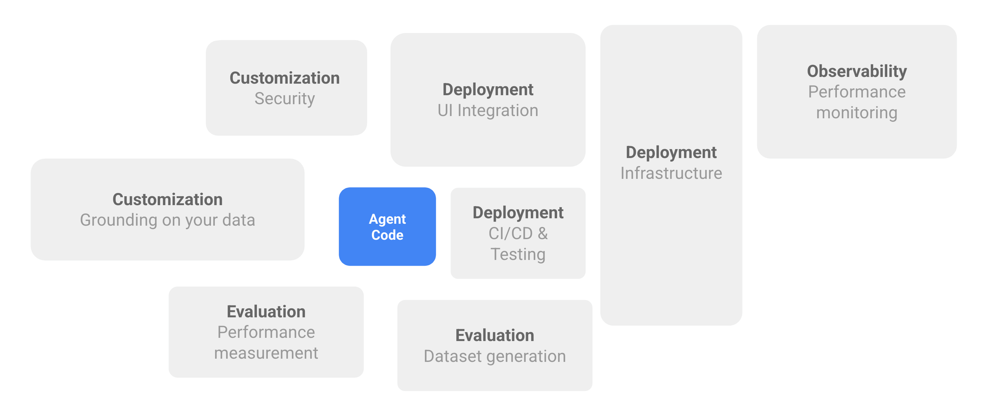
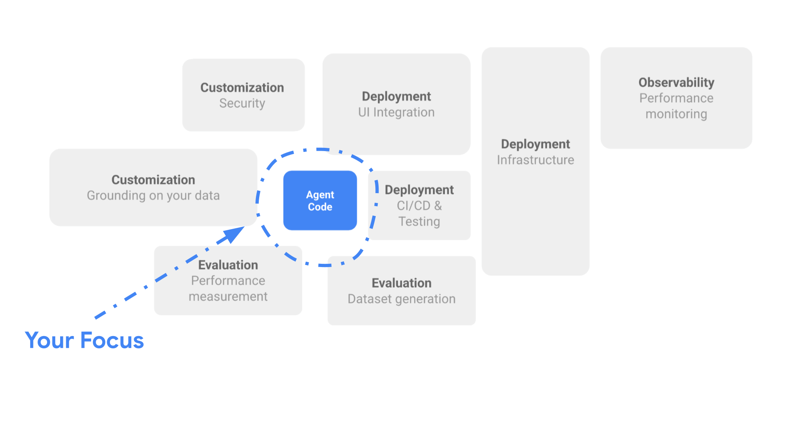
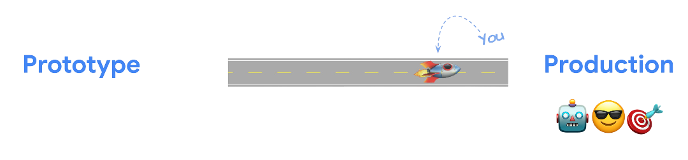

# Why an Agent Starter Pack?

Many developers successfully build initial Generative AI agent prototypes quickly – creating a basic chatbot or RAG system can feel straightforward. 
**However, the journey from that prototype to a robust, reliable, production-ready agent is where significant challenges arise.**

## The Production Gap: By the Numbers

Let's look at the reality of deploying GenAI agents:

*   **3 Months:** The time it took *us* – experienced GCP developers – to take even a *dummy* GenAI agent to a production-ready state.
*   **3-9 Months:** The typical timeframe we see developers to launch their *actual* GenAI agents into production (and this doesn't even account for projects that are ultimately abandoned).

**Why such a significant time investment?**

## The "Last Mile" Challenges

Based on our experience and feedback from developers, the real challenge isn't in the initial AI experimentation, but rather in meeting the comprehensive requirements for production deployment – the "last mile" that ultimately delivers business value:

1.  **Customization & Integration:**
    *   **Business Logic:** Tailoring the agent's behaviour to specific business needs and processes.
    *   **Data Grounding:** Securely connecting the agent to relevant, high-quality, and fresh company data.
    *   **Security & Compliance:** Implementing robust data privacy controls, access management, and safeguards against adversarial attacks.

2.  **Rigorous Evaluation:**
    *   **Performance Measurement:** Defining metrics and systematically assessing the agent's quality, accuracy, and safety *before* it goes live.
    *   **Dataset Generation:** Often requiring the creation of synthetic or curated datasets for thorough evaluation and fine-tuning.

3.  **Deployment & Operations (MLOps/LLMOps):**
    *   **Infrastructure:** Building scalable, resilient, and cost-effective cloud infrastructure to host the agent.
    *   **CI/CD & Testing:** Establishing automated pipelines for continuous integration, delivery, comprehensive testing (unit, integration, load), and enabling rapid iteration and safe rollbacks.
    *   **UI Integration:** Seamlessly embedding the agent into user-facing applications for a consistent experience.

4.  **Observability & Monitoring:**
    *   **Performance Monitoring:** Tracking the agent's operational health, latency, and resource consumption in real-time.
    *   **Data Collection:** Capturing user interactions and agent responses for ongoing monitoring, evaluation, and fine-tuning.
    *   **User Feedback:** Implementing mechanisms to collect and process user feedback for continuous improvement.

## Bridging the Gap with the Agent Starter Pack
Recognizing these common, time-consuming hurdles, we created the **Agent Starter Pack**.

The core idea is simple: **You focus on your core Agent code** – the unique logic, prompts, and tools that define *your* specific AI application – while **we provide the template foundation** for everything else needed to run it reliably in production.

Think of it like this:

*   **Your Focus (The Core Agent):**
    *   Prompts and LLM interactions
    *   Business logic integration
    *   Agent orchestration (LangGraph, CrewAI, Google ADK)
    *   Tools and data source definitions

*   **Our Foundation (The Starter Pack Template):**
    *   **Deployment & Operations:** API server, serving options, CI/CD pipelines, IaC, testing
    *   **Observability:** Logging, tracing, and monitoring dashboards
    *   **Evaluation:** Vertex AI Evaluation integration
    *   **Data & UI:** Storage connections, vector stores, UI playground
    *   **Security:** GCP security best practices

## How the Agent Starter Pack Helps:

*   **Faster Setup with Production Patterns:** Get a head start with pre-built components for API serving, CI/CD, and observability based on common Google Cloud practices, saving significant setup time.
*   **Focus on Core Agent Logic:** Spend less time on infrastructure and MLOps, allowing your team to concentrate more on refining the unique prompts, tools, and capabilities of your agent.
